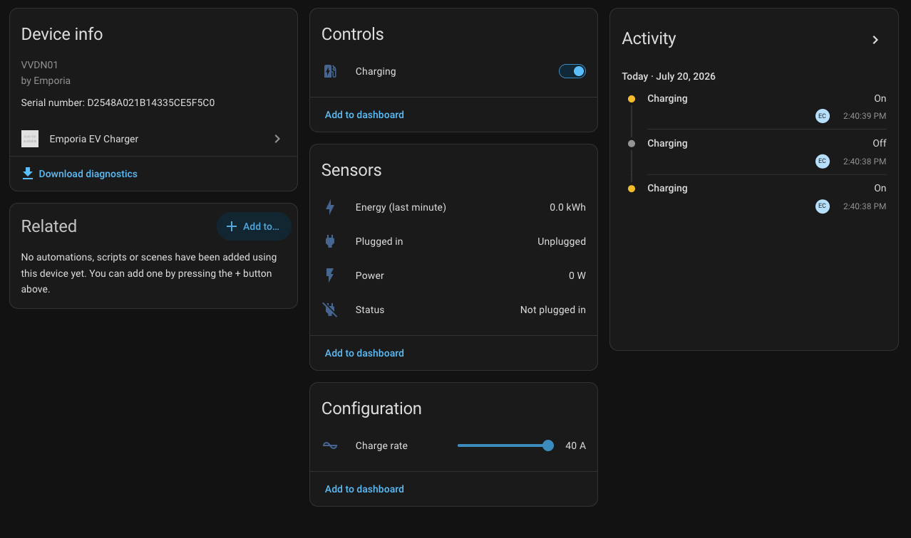
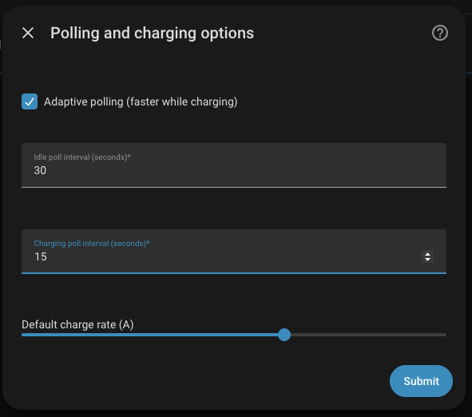

# Emporia EV Charger — Home Assistant Integration

A custom HACS integration that brings your Emporia Level 2 EV charger into
Home Assistant: start and stop charging, set the charge rate, monitor power
draw and status, and wire everything into your automations.

> **Cloud-only.** The Emporia charger has no local API. This integration
> connects to `api.emporiaenergy.com` using the same AWS Cognito credentials
> as the official app. A working internet connection is required.



---

## Contents

- [Features](#features)
- [Requirements](#requirements)
- [Installation (HACS)](#-installation-hacs)
- [Configuration](#configuration)
- [Entities](#entities)
- [Options](#options)
- [Energy Dashboard](#energy-dashboard)
- [Community EV-Charger Card](#community-ev-charger-card)
- [Reauthorisation](#reauthorisation)
- [Multiple accounts](#multiple-accounts)
- [Troubleshooting](#troubleshooting)
- [Links](#links)

---

## Features

- 🔌 **One login → all chargers** auto-discovered, each as its own device
- 🎛️ **Charging switch** — start/stop, optimistic (responds instantly)
- 🎚️ **Charge-rate slider** — amperage, min/max read from the charger
- 📊 **Power / Energy / Status** sensors + a **Plugged-in** binary sensor
- 🚗 **Vehicle battery** sensor when a vehicle is linked in the Emporia app
- 🔁 **Adaptive polling** — faster while charging, relaxes when idle (configurable)
- 🔐 **Reauth-in-place** on token expiry; refresh token persisted across restarts
- ⚡ **Async throughout** — one batched cloud call per poll cycle, with retry on transient blips

---

## Requirements

- Home Assistant 2024.8 or later
- [HACS](https://hacs.xyz) installed
- An Emporia Energy account with at least one EV charger linked

---

## 📦 Installation (HACS)

[](https://my.home-assistant.io/redirect/hacs_repository/?owner=Eunanibus&repository=ha-emporia-ev&category=integration)

1. Install [HACS](https://hacs.xyz/) if you don't have it already.
2. Click the button above to open this repository in HACS — **or** add it
   manually: **HACS → ⋮ → Custom repositories**, paste
   `https://github.com/Eunanibus/ha-emporia-ev`, category **Integration**, **Add**.
3. Search for **Emporia EV Charger** and click **Download**.
4. **Restart Home Assistant.**
5. Add the integration via **Settings → Devices & Services → Add Integration**
   (see Configuration below).

---

## Configuration

After restarting, go to **Settings → Devices & Services → Add Integration**
and search for **Emporia EV Charger**.

You will be prompted for:

| Field        | Description                   |
| ------------ | ----------------------------- |
| **Email**    | Your Emporia account email    |
| **Password** | Your Emporia account password |

The integration authenticates via AWS Cognito (same credentials as the Emporia
app). Tokens are refreshed automatically; you should rarely need to log in
again.

Once authenticated, a device is created for each EV charger on the account and
all entities are registered immediately.

---

## Entities

Each charger creates the following entities. Entity IDs are composed from the
device name, e.g. a charger named **Garage** produces `switch.garage_charging`.
All entity names are device-relative (`has_entity_name = True`).

| Platform        | Entity                   | Example entity ID                  | Description                                                                                                                                                                                                                 |
| --------------- | ------------------------ | ---------------------------------- | --------------------------------------------------------------------------------------------------------------------------------------------------------------------------------------------------------------------------- |
| `switch`        | **Charging**             | `switch.<name>_charging`           | Enable or disable charging. Uses optimistic state — the UI updates immediately and reconciles with the next cloud poll.                                                                                                     |
| `number`        | **Charge rate**          | `number.<name>_charge_rate`        | Amperage slider. Min/max are read from the charger (fallback: 6–48 A). Shown in the Configuration category.                                                                                                                 |
| `sensor`        | **Power**                | `sensor.<name>_power`              | Charging power in **W**. This is the primary energy-monitoring signal. Derived from the Emporia 1-minute energy bucket (kWh × 60 × 1 000), so it is an _average_ over the last ~1 minute, not a true instantaneous reading. |
| `sensor`        | **Energy (last minute)** | `sensor.<name>_energy_last_minute` | kWh consumed in the most recent 1-minute window. Resets each minute — **not** a lifetime total and **not** suitable as a direct Energy-dashboard source. Useful for at-a-glance display and automations.                    |
| `sensor`        | **Status**               | `sensor.<name>_status`             | Enum: `charging` / `plugged_in_idle` / `not_plugged_in` / `error`.                                                                                                                                                          |
| `binary_sensor` | **Plugged in**           | `binary_sensor.<name>_plugged_in`  | `on` when a vehicle is connected to the charger.                                                                                                                                                                            |
| `sensor`        | **Vehicle battery**      | `sensor.<name>_vehicle_battery`    | State-of-charge percentage of the linked vehicle. Only present when a vehicle is associated with the charger in the Emporia app.                                                                                            |

---

## Options

After setup, click **Configure** on the integration card to adjust polling and
default behaviour.



| Option                     | Default | Description                                                                                                                                                     |
| -------------------------- | ------- | --------------------------------------------------------------------------------------------------------------------------------------------------------------- |
| **Idle poll interval**     | 30 s    | How often to poll when not charging.                                                                                                                            |
| **Charging poll interval** | 15 s    | How often to poll while a session is active (faster refresh for live power data).                                                                               |
| **Adaptive polling**       | Enabled | Automatically switches between the two intervals based on charging state, with hysteresis to avoid rapid toggling. Disable to always poll at the idle interval. |
| **Default charge rate**    | 32 A    | The amperage applied when the Charging switch is turned on and no prior rate is known.                                                                          |

---

## Energy Dashboard

### Why you cannot add an Emporia sensor directly

The Emporia cloud API exposes _per-bucket energy_ (kWh in the last 1-minute
window) rather than a running lifetime meter. Because the
**Energy (last minute)** sensor resets each minute it does not have
`state_class: total_increasing`, which is what the Energy dashboard requires
in order to record a cumulative total. Attempting to add it as a dashboard
source will not work correctly.

### Option 1 — Riemann-sum integral helper (recommended)

Create a helper that integrates the **Power** sensor over time to produce a
proper cumulative kWh counter:

1. Go to **Settings → Devices & Services → Helpers → Create Helper**.
2. Choose **Integration — Riemann sum integral**.
3. Configure:

   | Field                  | Value                         |
   | ---------------------- | ----------------------------- |
   | **Name**               | e.g. `Garage EV energy total` |
   | **Input sensor**       | `sensor.<name>_power`         |
   | **Integration method** | Trapezoidal or Left           |
   | **Metric prefix**      | k (produces kWh)              |
   | **Time unit**          | Hours                         |

4. The resulting sensor has `state_class: total_increasing` and can be added to
   **Settings → Energy → Individual devices** as an energy source.

### Option 2 — Utility meter helper (billing cycles)

Add a [`utility_meter`](https://www.home-assistant.io/integrations/utility_meter/)
helper on top of the Riemann-sum sensor to reset at the start of each billing
cycle and track monthly totals.

### Why Power rather than Energy (last minute)?

The Power sensor is updated on every coordinator poll (every 15–30 seconds)
and the Riemann integration accumulates those readings over time into a
reliable kWh figure. The Energy (last minute) value is a raw per-bucket
reading that would be double-counted or miscounted if used directly as a
cumulative source.

---

## Community EV-Charger Card

The
[Lovelace EV Charger card](https://github.com/tmjo/charger-card)
(available in HACS) provides a purpose-built UI for EV chargers. Map its slots
to the real entity IDs:

```yaml
type: custom:charger-card
entity: switch.<name>_charging
customCardTheme: theme_custom
details:
  collapsibles: []
  info:
    - type: attribute
      attribute: ""
  stats:
    default:
      - entity_id: sensor.<name>_power
        unit: W
        subtitle: Power
      - entity_id: sensor.<name>_status
        subtitle: Status
      - entity_id: number.<name>_charge_rate
        unit: A
        subtitle: Charge rate
    charging:
      - entity_id: sensor.<name>_power
        unit: W
        subtitle: Power
      - entity_id: binary_sensor.<name>_plugged_in
        subtitle: Plugged in
toolbar:
  default:
    - service: switch.turn_on
      service_data:
        entity_id: switch.<name>_charging
      label: Start
      icon: mdi:play
    - service: switch.turn_off
      service_data:
        entity_id: switch.<name>_charging
      label: Stop
      icon: mdi:stop
```

> **No lifetime energy entity.** If the card has a dedicated kWh/energy slot,
> point it at the Riemann-sum helper you created (see
> [Energy Dashboard](#energy-dashboard)), not at `sensor.<name>_energy_last_minute`.

---

## Reauthorisation

If your Emporia password changes, or if the Cognito token can no longer be
refreshed, the integration will surface a **reauthentication required** banner
in Home Assistant.

Click the banner (or **Configure → Reauthenticate**) and enter your updated
credentials. The config entry and all associated entities are preserved — no
re-setup required.

---

## Multiple accounts

Each Emporia account is a separate config entry. You can add the integration
more than once with different credentials and all chargers from all accounts
will appear as separate devices in Home Assistant.

---

## Troubleshooting

**Entities are unavailable / coordinator fails**

Check that `api.emporiaenergy.com` is reachable from your HA host. The
integration will log the underlying error at `WARNING` level; enable debug
logging for more detail:

```yaml
# configuration.yaml
logger:
  default: warning
  logs:
    custom_components.emporia_ev: debug
```

**Power reads 0 W / Energy (last minute) reads 0 kWh when charging**

The Emporia API returns a 1-minute energy bucket. At the start of a session
the first bucket may be zero or very small. Values typically stabilise within
one or two poll cycles.

**Vehicle battery sensor is missing**

The `sensor.<name>_vehicle_battery` entity is only created when a vehicle is
linked to the charger in the Emporia mobile app. Link the vehicle there and
restart Home Assistant (or reload the integration) to create the entity.

**Status sensor shows "error"**

This indicates the integration received a status string from the API that is
not in the known set (`charging`, `plugged_in_idle`, `not_plugged_in`). File
an issue on GitHub with the raw status value from the integration diagnostics.

---

## Links

|     |                                                                                    |
| --- | ---------------------------------------------------------------------------------- |
| 📂  | **Repo:** <https://github.com/Eunanibus/ha-emporia-ev>                             |
| 🐛  | **Issues / feature requests:** <https://github.com/Eunanibus/ha-emporia-ev/issues> |
| 📦  | **Latest release:** <https://github.com/Eunanibus/ha-emporia-ev/releases/latest>   |

Pull requests welcome.

---

_Integration maintained by [Eunanibus](https://github.com/Eunanibus). Not
affiliated with Emporia Energy._
