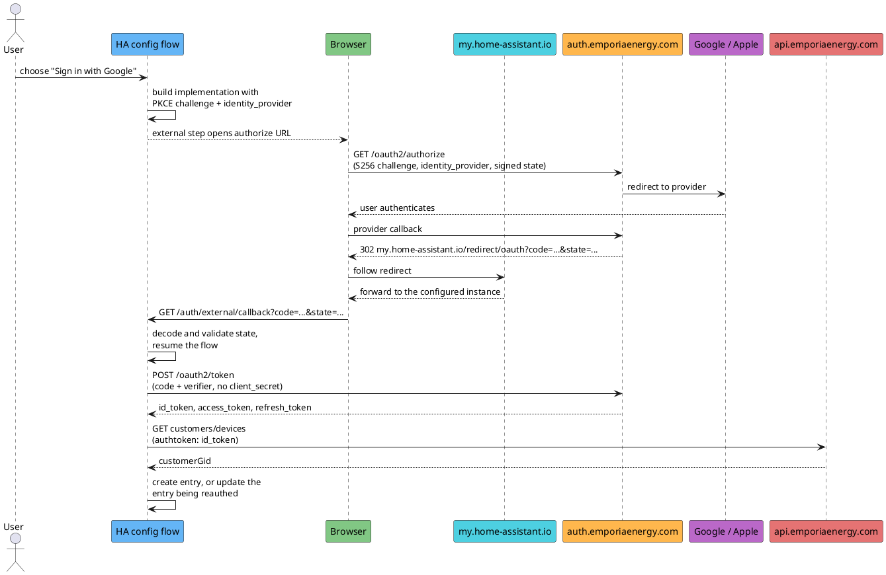

# Design: Google and Apple sign-in over Home Assistant's native OAuth flow

Status: approved, not yet implemented.
Issue: [#2 Oauth Sigin](https://github.com/Eunanibus/ha-emporia-ev/issues/2).
Branch: `feat/oauth-signin`, cut from `main`.

## Problem

The config flow authenticates only with Cognito SRP using an email and password.
An Emporia account created through "Continue with Google" or "Continue with Apple" is a federated user in Emporia's Cognito pool.
A federated user has no password, and its pool username is `Google_<provider-user-id>` rather than an email, so SRP fails with `UserNotFoundException`.
Those users cannot set the integration up at all.

Emporia's cloud team has registered `https://my.home-assistant.io/redirect/oauth` as an allowed callback on the app client the integration already uses.
That is the redirect Home Assistant's own OAuth helper emits, so the authorization code flow can now run end to end inside Home Assistant with no manual step.

## Verified facts

Confirmed against Emporia's live pool on 2026-09-03 by sending unauthenticated `GET` requests to `https://auth.emporiaenergy.com/oauth2/authorize` and reading the `Location` response header.
A registered redirect returns `302` to `/login`; an unregistered one returns `302` to `/error?error=redirect_mismatch`.

Redirect URIs registered on app client `4qte47jbstod8apnfic0bunmrq`:

| Redirect URI                                  | Result              |
| --------------------------------------------- | ------------------- |
| `https://my.home-assistant.io/redirect/oauth` | accepted            |
| `https://web.emporiaenergy.com/`              | accepted            |
| `http://my.home-assistant.io/redirect/oauth`  | `redirect_mismatch` |
| `http://localhost:8080/`                      | `redirect_mismatch` |

The scheme is part of the match, so only the `https` form of the My Home Assistant redirect works.
`http://localhost:8080/` is not registered, so there is no callback that terminates on the user's own machine and no paste-based fallback to offer.

Client and grant facts:

- PKCE `S256` is accepted but not required: the authorize request succeeds with and without `code_challenge`.
- The client is public and has no secret.
- The `authorization_code` and `refresh_token` grants are both enabled, and the accepted scope is `openid email`.
- `identity_provider=Google` reaches Google, and `identity_provider=SignInWithApple` reaches `appleid.apple.com` with Emporia's service id `com.auth.emporiaenergy.prod`.

Carried over from the 2026-08-31 investigation against a real Google-federated Emporia account, and unchanged by this design:

- A code exchange returns `id_token`, `access_token` and `refresh_token`, with `expires_in` 3600.
- The id token is genuinely federated: `cognito:username` is `Google_<id>` and `identities[0].providerName` is `Google`.
- The id token carries an `email` claim for Google, alongside `email_verified` false.
  The claim depends on the pool's IdP attribute mapping and is not guaranteed for Apple, so this design treats it as optional.
- `GET https://api.emporiaenergy.com/customers/devices` with header `authtoken: <IdToken>` returns 200 and a `customerGid`, which is the config entry `unique_id`.
- `InitiateAuth` with `REFRESH_TOKEN_AUTH`, the integration's existing refresh call, works unchanged on a hosted UI refresh token and preserves the federated claims.
- A refresh returns `AccessToken`, `ExpiresIn`, `IdToken` and `TokenType` only, and issues no new refresh token.

Home Assistant facts, read from the pinned 2025.1.4 in `.venv`:

- `helpers/config_entry_oauth2_flow.py` defines `MY_AUTH_CALLBACK_PATH = "https://my.home-assistant.io/redirect/oauth"`, byte-identical to what Emporia registered.
- `LocalOAuth2Implementation.redirect_uri` returns that constant only when the `my` component is loaded, and otherwise derives a URL from the request's frontend base header.
- `LocalOAuth2Implementation._token_request` omits `client_secret` from the body when the attribute is `None`, which is what a public client needs.
- The helper has no PKCE support, and the two extension points that can add it are `extra_authorize_data` and `async_resolve_external_data`.
- `components/auth/__init__.py` registers `OAuth2AuthorizeCallbackView` at `/auth/external/callback`, so the callback endpoint belongs to the `auth` component rather than to this integration.
- The callback view validates `state` by decoding the JWT the helper signed, and on failure answers "Invalid state. Is My Home Assistant configured to go to the right instance?".
- The signing secret is generated per run, so a sign-in that spans a Home Assistant restart fails that check and shows that same message, which misdiagnoses the cause.
- `async_step_creation` calls `async_oauth_create_entry` with `{"auth_implementation": ..., "token": token}` rather than the token dict itself.
- `components/my` registers a redirect panel and has nothing to do with the OAuth callback, so the `my` check inside `redirect_uri` is a proxy for "this instance is reachable through my.home-assistant.io" rather than a functional requirement.
- `LocalOAuth2Implementation.__init__` annotates `client_secret` as `str`, both in 2025.1.4 and on `dev`.
- Home Assistant `dev` adds `LocalOAuth2ImplementationWithPkce`, an `extra_token_resolve_data` hook, and a `redirect_uri` refactored to `async_get_redirect_uri(self.hass)`.
  Overriding `redirect_uri` and `async_resolve_external_data` stays valid on both, and the PKCE override becomes deletable if the supported floor ever rises to a release shipping that class.

## Design

### Approach

The config flow subclasses `AbstractOAuth2FlowHandler`.
That yields the external step, the callback view, the signed `state`, the code exchange and the step timeouts from supported public API, and it is the same machinery every cloud OAuth integration in core uses.

Two alternatives were rejected.
Hand-rolling `async_external_step` and reusing the callback view means depending on the private `_decode_jwt` to validate `state`, which buys only nicer error strings.
Registering Google and Apple as two implementations and letting the helper render its own `pick_implementation` picker gives generic picker text and leaves password sign-in, the primary path, with nowhere natural to sit.

Unlike core OAuth integrations, this one does not use `application_credentials`.
Core cannot ship client secrets, so core integrations ask the user for credentials.
This integration pins Emporia's own public client id, exactly as the SRP path already does, so there is nothing for a user to supply and the implementation is constructed inside the flow.

### Config flow shape

```python
class EmporiaConfigFlow(AbstractOAuth2FlowHandler, domain=DOMAIN):
    DOMAIN = DOMAIN
    VERSION = 1

    @property
    def logger(self) -> logging.Logger: ...
```

`async_step_user` overrides the base implementation, which would otherwise jump straight to `async_step_pick_implementation`, and returns a menu:

```text
menu_options = {
    "password": "Email and password",
    "apple": "Sign in with Apple",
    "google": "Sign in with Google",
}
```

#### Why a menu and not one form with social buttons

The wanted shape is username and password fields, an "or" divider, then two branded buttons.
Home Assistant cannot render that, for three separate reasons in `data_entry_flow.py`:

- `FlowResultType` makes `FORM` and `MENU` distinct result types, and a step returns exactly one, so no step can show schema fields and navigation targets together.
- A `FORM` renders its schema fields plus one submit button.
  Nothing in a form can move the flow to another step except submitting that form.
- `async_show_menu` accepts only `menu_options` and `description_placeholders`, and `data_entry_flow.py` contains no icon support at all, so menu entries cannot carry a Google or Apple mark.

A single form carrying a radio selector for the method alongside optional username and password fields would put everything on one screen, but it forces conditional validation, shows credential fields to someone who picked Google, and still has no icons.
That is worse than the menu, so it is rejected.

The menu is therefore three labelled rows, with `password` first so the common case stays the default.
Choosing `password` costs one extra click compared to today.

Today's email and password logic moves unchanged into `async_step_password`.
`async_step_user` ignores `user_input` and always returns the menu, because `async_show_menu` does not mark `next_step_id` required, so an empty submit validates and the flow manager re-dispatches back into the same step.

`async_step_google` and `async_step_apple` each build an `EmporiaOAuth2Implementation` for their provider, assign it to `self.flow_impl`, and delegate to `self.async_step_auth()`.
There is no form and no user input on the social path: the next thing the user sees is Emporia's hosted login page.

The implementation is deliberately **not** passed to `async_register_implementation`.
It carries a PKCE verifier scoped to one flow, and registering it would stash that per-flow secret in `hass.data` where a later flow could pick it up.
Assigning `self.flow_impl` directly is sufficient because the flow object persists across the external step, so the same instance performs the exchange.
Nothing else needs the registry: it feeds `async_step_pick_implementation`, which is bypassed, and `async_get_config_entry_implementation`, which only matters to `OAuth2Session`, which this integration does not use.

### The OAuth implementation class

`EmporiaOAuth2Implementation(LocalOAuth2Implementation)` is constructed with the provider and a fresh PKCE challenge, passes `client_secret=None`, and overrides four members.
The base class annotates `client_secret` as `str` while `_token_request` omits the field only when it is `None`, so the constructor call needs `cast("str", None)` to satisfy `mypy --strict`.
It must not be "corrected" to `""`, which would post an empty secret to a client that has none.

`redirect_uri` returns `MY_AUTH_CALLBACK_PATH` unconditionally, where the base class returns it only when the `my` component is loaded.
Emporia accepts exactly one Home Assistant redirect, so an instance without `my` loaded would derive its own external URL and fail every sign-in with `redirect_mismatch`.
The stronger reason is that the base class's fallback reads the frontend base header off the current request and raises `RuntimeError("No current request in context")` when there is none, which is precisely the situation in a reauth flow started in the background by `ConfigEntryAuthFailed`.
Hardcoding the constant also keeps the behaviour independent of the running Home Assistant version, which matters because the README supports 2024.8 and up while only 2025.1.4 is pinned for development.

`extra_authorize_data` adds `scope` (`openid email`), `identity_provider` for the chosen provider, `code_challenge` and `code_challenge_method=S256`.
The base class contributes `response_type`, `client_id`, `redirect_uri` and `state`.

`async_resolve_external_data` adds `code_verifier` to the base class's token request body.
PKCE is kept even though Cognito does not require it, because the client is public: without it a leaked authorization code is redeemable by anyone, and the cost is about ten lines that already exist.

`name` and `domain` satisfy the abstract interface.
`name` is never user visible, because `async_oauth_create_entry` is overridden and does not use it for the entry title.

### What the port drops

`client/oauth.py` is ported from `feat/federated-signin` and shrinks substantially, because Home Assistant now owns most of what it did.

Deleted: `build_authorize_url`, `parse_redirect`, `async_exchange_code`, the registered-localhost constant, and all four of `OAuthPasteError`, `OAuthStateMismatchError`, `OAuthCancelledError` and `OAuthCodeExpiredError`.
Nothing pastes a URL, so there is no input to parse or reject; the helper validates `state` in its callback view; and the helper performs the exchange.

Kept: the provider mapping table and its inverse, `generate_pkce`, the id-token email decode, and `async_revoke_refresh_token`.

### Provider identifiers

Two providers appear in three forms, so one module-level mapping in `client/oauth.py` keyed by menu id is the only place the correspondence is written down.

| Menu id  | Cognito `identity_provider` | Display name |
| -------- | --------------------------- | ------------ |
| `google` | `Google`                    | Google       |
| `apple`  | `SignInWithApple`           | Apple        |

Social reauth reads the stored `oauth_provider`, which is the Cognito value, so the module also exposes the inverse lookup with an explicit fallback, so that an unrecognised stored value cannot raise `KeyError` part way through a reauth.

### Sequence



### Entry data

Password entries keep exactly their current shape.
Social entries are stored as:

```python
{
    "auth_method": "oauth",              # absent on existing entries, meaning password
    CONF_USERNAME: "user@example.com",   # optional: only when the id token carries email
    # CONF_PASSWORD deliberately absent
    "account_id": "459737",
    "refresh_token": "<hosted UI refresh token>",
    "oauth_provider": "Google",          # Cognito identity_provider value
}
```

A missing `auth_method` means password, so existing entries keep working with no schema migration.
`VERSION` stays 1 and `async_migrate_entry` is untouched.

The base class's `auth_implementation` and `token` keys are not stored.
`EmporiaAuth` owns the token lifecycle through Cognito's `REFRESH_TOKEN_AUTH`, so a stored access token and expiry would be a second source of truth that nothing reads.

The entry title stays `Emporia ({account_id})` for both methods.
`diagnostics.py` emits `entry.title` unredacted while `email` is listed in `TO_REDACT`, so putting an email in the title would leak it into diagnostics that users paste into public issues.
Keeping the existing title also removes any dependency on a claim that may be absent for Apple, which would otherwise reproduce the `Emporia (None)` signature of issue #1.

`unique_id` remains the `customerGid` string for both methods.
Whether a native and a federated Emporia account share a `customerGid` is not established, so no claim is made about what happens when someone adds both.

`__init__.py` reads `entry.data.get(CONF_USERNAME)` and `entry.data.get(CONF_PASSWORD)`.
`EmporiaAuth.__init__` already declares username, password and refresh token as optional keyword arguments defaulting to `None`, so a social entry constructs correctly with only a refresh token.
`client/auth.py` and `client/client.py` need no changes: `client.py` already fetches a token before reading `auth_headers()`, and `auth.py` already prefers the refresh branch whenever a refresh token is present.

### Create versus reauth

`async_oauth_create_entry` receives `{"auth_implementation": ..., "token": token}`, not the token dict itself, so the refresh token lives at `data["token"]["refresh_token"]`.
It decodes the optional email, resolves the `customerGid`, and branches.
Without the branch, reauth aborts with `already_configured` and strands exactly the users this feature exists for.

```python
token = data["token"]
account_id = await async_validate_refresh_token(self.hass, token["refresh_token"])
await self.async_set_unique_id(account_id)

if self.source == SOURCE_REAUTH:
    entry = self._reauth_entry
    if account_id != entry.unique_id:
        return self.async_abort(reason="wrong_account")
    return self.async_update_reload_and_abort(
        entry, data={**entry.data, "refresh_token": token["refresh_token"]}
    )

self._abort_if_unique_id_configured()
return self.async_create_entry(title=f"Emporia ({account_id})", data={...})
```

This keeps the manual `unique_id` comparison and the `**entry.data` splat that the current reauth path already uses.
`_abort_if_unique_id_mismatch`, `_get_reauth_entry` and `data_updates=` all exist in the pinned 2025.1.4 and would read better, but which release introduced them is not established, `README.md` promises 2024.8, and `hacs.json` declares no `homeassistant` floor, so HACS will install this on anything.
Using only the APIs the file already depends on avoids silently breaking older installs to save three lines.

### Resolving the account id on the social path

`async_validate_login` takes a username and password, so it cannot be reused.
A sibling `async_validate_refresh_token(hass, refresh_token) -> str` constructs `EmporiaAuth(session, refresh_token=refresh_token)`, calls `client.authenticate()`, and raises `EmporiaError` when `client.account_id` is falsy, preserving the issue #1 guard against an entry titled `Emporia (None)`.

This spends one `REFRESH_TOKEN_AUTH` round trip at setup instead of reusing the `id_token` already in hand.
That is a deliberate trade: seeding tokens into `EmporiaAuth` would add a method to an object that runs on every poll cycle, and the cost is one request, once.

`AuthError` subclasses `EmporiaError`, so the `except` chain keeps the narrow branches first, as the current flow already documents.
On the social path `AuthError` must not map to `invalid_auth`, whose string reads "Invalid email or password" and would be nonsense after a Google sign-in.

### Reauth

`async_step_reauth_confirm` branches on `auth_method`.
Password entries keep today's password form.
Social entries show a form with no fields, and build the implementation for the stored `oauth_provider` and enter `async_step_auth()` only once the user submits it.

That empty form is not ceremony.
`ConfigEntryAuthFailed` starts the reauth flow in the background, with nobody watching and no request in context, so `async_step_reauth_confirm` runs at the moment of failure.
Entering `async_step_auth` there would mint an authorize URL immediately and park the flow in an external step, so opening the notification would throw the user straight into a browser hand-off with no explanation of what it is for.
Core's OAuth integrations use a no-input confirm step for the same reason.

Two existing defects in the code being edited are fixed while it is open:

- `strings.json` interpolates `{username}` but the reauth step passes no `description_placeholders`, so users see the literal `{username}`.
- The `wrong_account` string says "Those credentials are for a different Emporia account", which does not fit a social sign-in.

### Error handling and translations

The translation work is larger than a handful of new keys, because the step layout changes.
Both `strings.json` and `translations/en.json` carry every change below.

- `config.step.user` becomes the menu: title, description, and `menu_options` labels for `password`, `google` and `apple`.
  Without those labels the picker renders raw step ids.
- The current `config.step.user` body, which is the password form, moves to `config.step.password` unchanged.
- The external step is translated at `config.step.auth.title`, as core's own OAuth integrations do.
  `config.progress` is for `SHOW_PROGRESS` steps and does not apply here.
- `config.step.reauth_confirm` gains the no-input social variant.

New `config.abort` entries: `authorize_url_timeout`, `no_url_available`, `oauth_timeout`, `oauth_unauthorized`, `oauth_failed`, `oauth_error`, `oauth_implementation_unavailable` and `user_rejected_authorize`.
`missing_credentials` and `missing_configuration` cannot occur, because `self.flow_impl` is always assigned before `async_step_auth`, so they are omitted.
`oauth_implementation_unavailable` exists only on newer releases and is harmless on older ones.

`cannot_connect` and `unknown` exist today only under `config.error`, which the frontend reads for form errors.
The social path has no form after the external step, so both failures abort instead and need `config.abort` entries of their own.
The `config.error` entries stay for the password form.

`oauth_failed` carries the case that matters most in practice.
A code that expired or was already used returns 400 `invalid_grant`, which the base class raises through `raise_for_status()` and turns into that abort, ending the flow rather than re-rendering a retry.
Its string therefore says the sign-in did not complete and to start again from the integrations page.

This integration's own code logs no authorization code, PKCE verifier or token.
The base class does log the whole token dict at warning level when a token response omits `expires_in`; Cognito always sends it, so the path is unreachable in practice, but this is a property of the helper rather than an invariant this design controls.

### Token expiry behaviour

A refresh issues no new refresh token, so a social entry's refresh token has a fixed absolute lifetime configured on Emporia's app client, which cannot be read from outside the pool.
Cognito's default refresh token validity is 30 days, so that is the cadence the documentation quotes, with the caveat that Emporia may have configured something else.

A password entry re-authenticates silently when its refresh token expires, because `async_get_access_token` catches the `AuthError` and falls back to a full SRP login using the stored credentials.
A social entry cannot fall back that way, because no credentials are stored.
When its refresh token expires, `coordinator.py` maps the `AuthError` to `ConfigEntryAuthFailed`, Home Assistant raises a reauth notification, and the user repeats the browser step.

### Revoking on removal

`async_remove_entry` posts the stored refresh token to `/oauth2/revoke` for social entries, best effort, with failures logged at debug and never blocking removal.
Deleting the integration should not leave a live account credential valid for weeks.

Best effort has to be implemented at the call site.
The ported helper raises `EmporiaError` on a non-200 and does not wrap transport failures, and Home Assistant logs anything `async_remove_entry` raises with `_LOGGER.exception`, so the call catches `(EmporiaError, aiohttp.ClientError, TimeoutError)` itself.

### Manifest

`manifest.json` gains `"dependencies": ["auth"]`, naming the component that registers `/auth/external/callback`.
It is not strictly required, because `frontend` already depends on `auth` so it is loaded on every real instance, but declaring it is precedented among core OAuth integrations and states the requirement rather than relying on it.
`requirements` stays empty: the helper is part of Home Assistant and the client is bundled.

## Testing

`tests/library/conftest.py` is added with a `session` fixture, because `_session()` with `aiohttp.ThreadedResolver()` is currently duplicated verbatim in `tests/library/test_auth.py` and `tests/library/test_client.py` to stop the pycares thread tripping `verify_cleanup`.
A naive `aiohttp.ClientSession()` in a new test file fails teardown.

`tests/library/test_oauth.py`, ported and trimmed to the surviving surface:

- `generate_pkce` produces a correct `S256` challenge, base64url encoded, unpadded.
- The provider table maps both menu ids to the right `identity_provider`.
- The id-token email decode handles a token with an `email` claim, a token without one, and a malformed payload.
- `async_revoke_refresh_token` covers success, an error status, and a transport failure, driven by `aioresponses` as the existing library tests are.

The fake id token is built inside the test with `base64.urlsafe_b64encode(json.dumps(claims))` rather than committed as a fixture.
`scripts/scrub_fixtures.py` replaces any `eyJ...` three-part string with `FAKE_TOKEN` and applies that to every string, so a committed decodable JWT fixture would be destroyed by the next scrub run.

`tests/integration/test_config_flow.py`:

- The six existing tests that enter through `async_step_user` each need a `{"next_step_id": "password"}` step inserted, and the result-type and `step_id` assertions corrected, because `async_step_user` now returns a menu whose `vol.In(menu_options)` schema is validated before dispatch.
  Their asserted behaviour is otherwise unchanged.
  The two reauth tests do not pass through `async_step_user` and are unaffected.
- The menu offers all three options.
- The social path is driven in three moves: assert the external step and its authorize URL, resume with `async_configure` carrying a fake `{"state": {...}, "code": ...}`, then call `async_configure` a second time with no input.
  The second call is required, because the first returns `EXTERNAL_STEP_DONE`, which parks in `cur_step`, and the flow manager only re-enters automatically for `SHOW_PROGRESS_DONE`.
  The `user_rejected_authorize` test needs the same second call.
- The fake `state` is the decoded dict, not a signed JWT.
  `async_resolve_external_data` reads `external_data["state"]["redirect_uri"]`, so `{"state": {"redirect_uri": MY_AUTH_CALLBACK_PATH}, "code": "abc"}` exercises the exchange without touching the private `_encode_jwt`.
- The token endpoint is stubbed with `aioclient_mock`, not the suite's existing `_PATCH_SESSION`.
  `_token_request` resolves its session through `helpers.aiohttp_client.async_get_clientsession`, which that patch does not reach, so a real session would be created and trip the lingering-thread guard the existing comment describes.
  `aioclient_mock` patches `_async_create_clientsession`, which does cover it.
- Assertions cover the authorize URL's `identity_provider`, `code_challenge_method`, `scope` and `redirect_uri`, that the token request body carries `code_verifier` and no `client_secret`, and that the created entry carries `auth_method` `oauth` and no password key.
- Reauth on a social entry updates the refresh token without aborting `already_configured`.
- Reauth with a different account aborts with `wrong_account`.
- A `user_rejected_authorize` resume aborts with that reason.

`tests/integration/test_init.py` gains `test_setup_social_entry_without_password`, using a `social_config_entry` fixture in `tests/integration/conftest.py` with no `password` key, following the existing patch stack.
This covers the line that actually breaks for the target users: `entry.data[CONF_PASSWORD]` raising `KeyError` so the entry never loads.

`tests/integration/test_diagnostics.py` gains assertions that a social entry's `refresh_token` is redacted and its title contains no email.

A green suite is not proof for this feature.
Google sign-in is verified end to end against the real Emporia cloud on the local Home Assistant instance before this ships.

## Documentation

- `README.md` gains a sign-in section covering the menu, the browser hand-off, the one-time My Home Assistant requirement, and the periodic re-authorization social entries need.
  The feature bullet, the Configuration table and the Reauthorisation section currently describe password entries only.
  The Troubleshooting note explaining that a federated user sees "Incorrect username or password" stays, because pool-level user-existence masking is unchanged, but it gains a pointer to the new menu.
  Troubleshooting also gains a line for "Invalid state. Is My Home Assistant configured to go to the right instance?", because the state signing secret is generated per run, so restarting Home Assistant part way through a sign-in produces that message even when My Home Assistant is configured correctly.
- `docs/emporia-cognito-facts.md` gains the hosted UI facts: endpoints, the registered redirect URIs, the public client, PKCE being optional, the accepted scope, the provider identifiers, and the fact that a refresh issues no new refresh token.
- Issue #2 gets a reply once Google is verified.

## Out of scope

- Converting an existing password entry to OAuth in place.
  No `async_step_reconfigure` is implemented; this is a deliberate omission.
- Any paste-based fallback for instances that cannot use My Home Assistant.
  No callback exists that could serve one.
- Vehicle battery entities, which remain blocked on a capture with a car plugged in.

## Risks

- Apple ships without an end to end test, because no Apple-linked Emporia account is available.
  The pool wiring is confirmed and the path differs from Google only by the `identity_provider` value.
  The README and the issue reply both say so, and issue #2's reporter is the natural person to confirm it.
- The integration reuses Emporia's own app client id and their registered redirect.
  Both are undocumented and could change without notice, as the disappearance of `http://localhost:8080/` shows.
  The same exposure already applies to the SRP path, which pins the same client id.
- Sign-in requires the browser to reach the instance through My Home Assistant, which needs a one-time setup in that browser.
  Users authenticating from a device that cannot reach the instance cannot complete the flow.
  This is the standard experience for cloud OAuth integrations in Home Assistant, and the helper's own error text names it.
- Adding `prompt=select_account` to the authorize URL would stop Google silently reusing whichever account the browser is signed into, which matters because wrong-account sign-in is easy on this path.
  Whether Cognito forwards the parameter to the IdP is unverified, so it is left out.
- The menu depends on `async_step_user` returning `async_show_menu`, and the social steps depend on the base class's `async_step_auth` remaining a supported override point.
  Both are widely used in core today.
